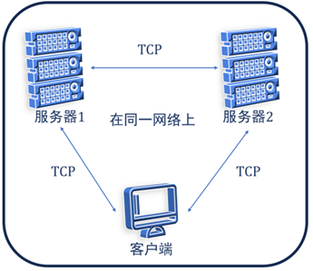

本项目基于[multi-party-sig](https://github.com/easedot/multi-party-sig)库进行编写,详见[README](easedot-multi-party-sig-README.md).


## Li24

我们在protocols/Li24目录下实现了我们的算法,并使用了go的测试框架"testing"进行了相关测试.

在该实现中,门限的定义为恶意参与方的最大数目,即无法恢复秘密的参与方集合的最大大小,这与我们方案描述中的定义是一致的.


## 三方签名demo

仿照[multi-party-sig](https://github.com/easedot/multi-party-sig)库,我们给出了使用Li24算法的三方签名演示,如下图所示,两方为服务器,一方为客户端.




### 服务端

```
ourexm2p/
go build m2p.go

./m2p -id=0 -srv=127.0.0.1:7001                      //server1
./m2p -id=1 -srv=127.0.0.1:8001 -p2p=127.0.0.1:7001  //server2
```

### 客户端

将ourmobile目录下的mobile_test.go文件中的p2p设置为两台服务器的IP地址+端口.

利用gotest进行测试.


### 性能测试

该demo与[multi-party-sig](https://github.com/easedot/multi-party-sig)库的实现方式一致,只是我们将门限签名算法由CGGMP21换成我们的Li24,通过比较两个demo的运行时间可测试我们的门限签名方案的性能.经测试,我们的方案在性能上有明显提升.
